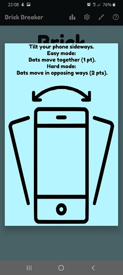
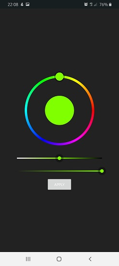
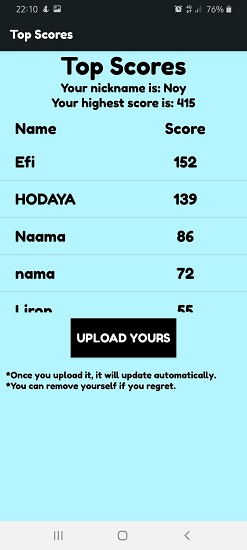

# BrickBreaker
## The brick breaker game with a twist ;)
 In the game there are 2 bats which move by sideways tilts of the phone.
 There are 2 modes - easy mode and hard mode.
 **In easy mode**, the bats move _**together**_ to the direction of the phone. You get _**1 point**_ for every brick hit.
 **In hard mode**, the bottom bat moves to the direction of the phone, but the top bat moves in the _**opposing way**_.
 You get _**2 points**_ for every brick hit. 
  Easy mode vs Hard mode:  

     
# The Home Screen

  At the top of the home screen there is the menu. 
  Right below the title, there is a button the shows your nickname. You can edit your nickname by clicking on it.
  Then there are you statistics. You can see your last score and the highest score you have gained.
  At the bottom, there is the play button that starts the game.

# The Help Dialog

  The help dialog helps you understand the game.
  It gives you information about the way you should tilt your phone and shows a visual example.
  It also explains the diffrence between the two difficulty levels.

# The Customize Screen

  In this screen you can customize the colors of the objects in the game - such as the ball, bricks, bats and background.
  In order to change a color of an object, click on the button right next to it. The color of the button represents the color of the object.
  Once you click on the button, you will be sent to the color picker screen, which will be explained right after this screen.
  In case you are lazy or undetermined, you can click the random button to get random colors.
  If you regret your choices, you can always go back to the defult state by clicking the defult button.
  Once you finish everything, click back to return to the home screen. Once the game starts you'll see the colors of the game are the ones you chose.
  In the easy mode example at the top of this page, you can see that the colors aren't the defult ones.

# The Color Picker Screen

  The color picker screen is the screen where you pick a color pfrom the palete.
  You can choose any color, and change the brightness and opicity with the bars below.
  Once you finish, click apply to save the color you picked.
  The color picker is from a great nuget that Lars Werkman has developed: https://github.com/LarsWerkman/HoloColorPicker.

# The Settings Dialog

  In the settings dialog you have diffrent settings you can change - such as sizes, difficulty and audio.
  First, there are the sizes of the ball and bricks. You can choose the size you prefer (small/medium/big). The defults are medium.
  Second, you can choose the difficulty(Easy/Hard). The defult is easy.
  In addition, there are two checkboxs you can check if you'd like to mute the background music or the game sounds.

# The Top Scores Screen

  In this screen you can see the top scores list of all the players that have chosen to upload theirs.
  At the top, you have your nickname and highest score (so you would know what score you are about to upload).
  Then there is the list. You can scroll through it and see the other players nicknames and top scores.
  After you have gotten impressed, you can upload your own score to the list. You just need to click the upload button.
  The text underneath is informing you that the changes will update automatically and that you can remove yourself from the list at any point.
  In case you regret, you can remove your score by clicking the remove button. It will remove you from the list.
  The list is in a cloud by Firestore.

# General Notes About The Game
  The game is developed in Xamarin Android.
  It was made for a school fianle project. The project was due the 31.3.21, but I likes working on it and finished very soon so I upgraded the app to be wider. I did it in a month and a half. The last commits are small and minor, to make the game more convenient.

